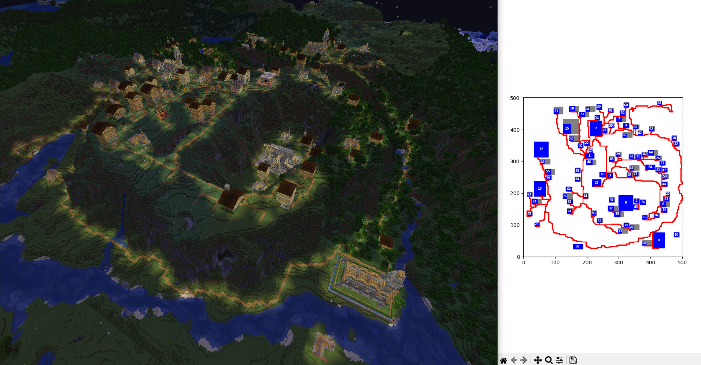
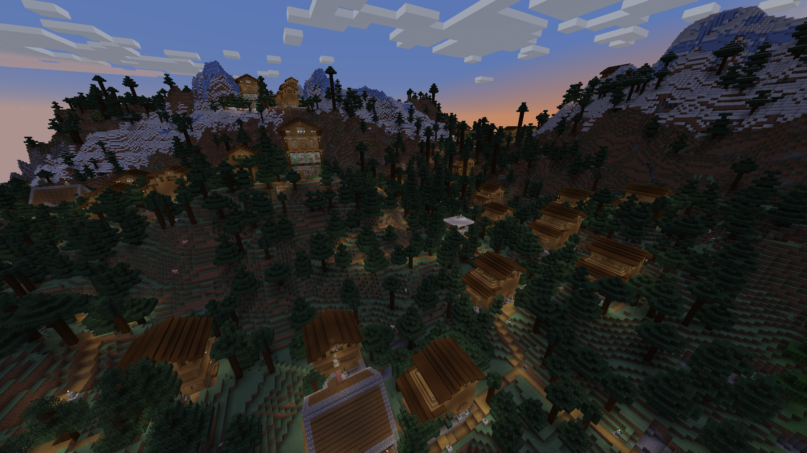
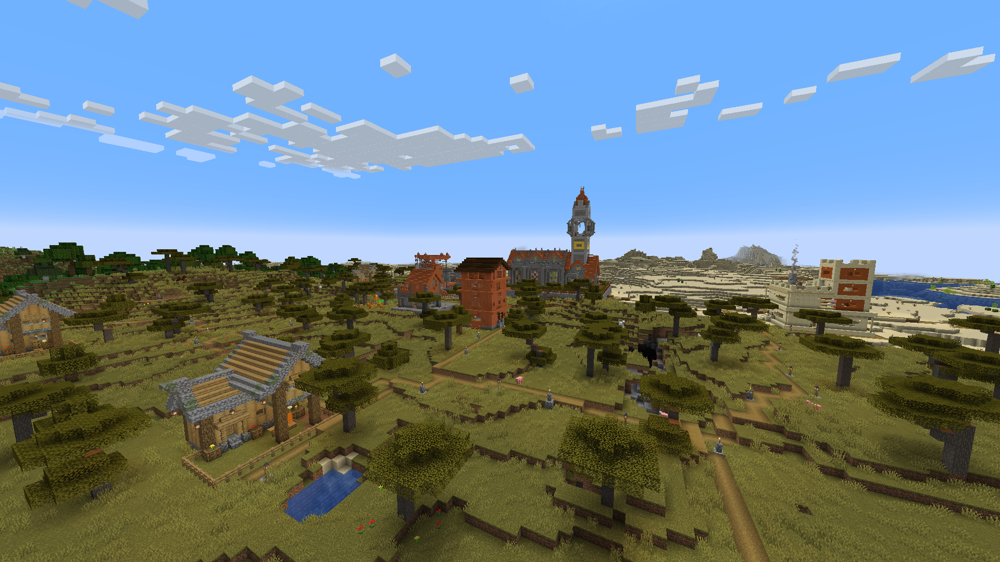
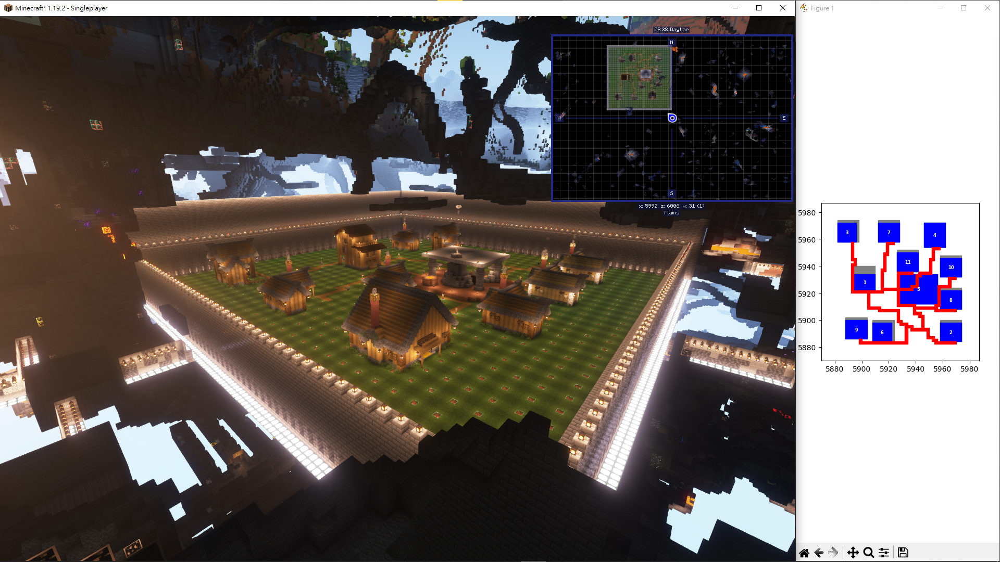
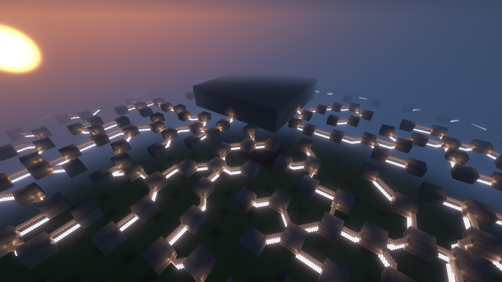
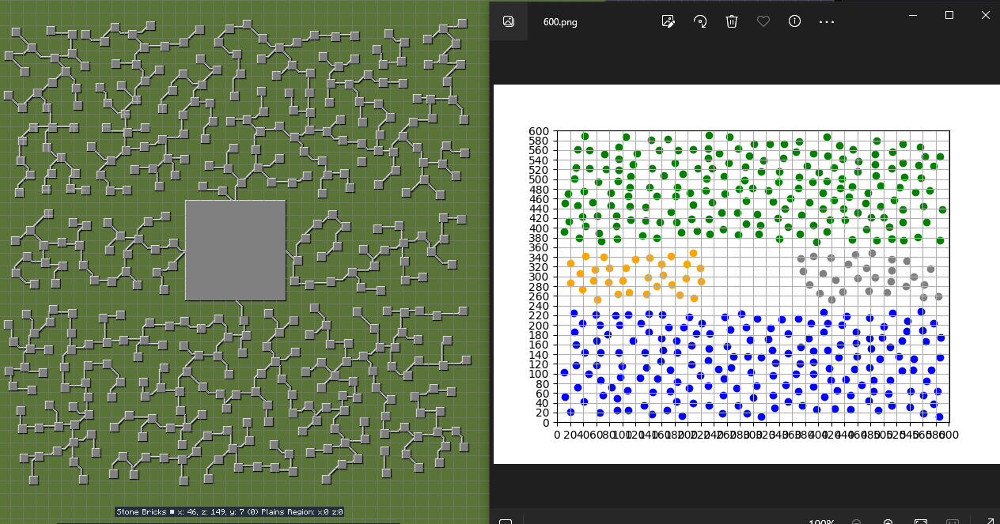

# GDMC - JEB_GEN_
This is a generator that facilitates Settlement Generation in Minecraft. It also **[clinched the top spot](https://www.youtube.com/watch?embeds_referring_euri=https%3A%2F%2Fgendesignmc.wikidot.com%2F&source_ve_path=Mjg2NjQsMTY0NTAz&feature=emb_share&v=onXUUhefLyY)** in the [6th annual GDMC - AI Settlement Generation Competition in Minecraft](https://gendesignmc.wikidot.com/), held at the [2023 IEEE Conference on Games](https://2023.ieee-cog.org/). This project is based on the [GDPC](https://github.com/avdstaaij/gdpc) project.
## Requirements

- Python 3.10

## Installation

1. Clone this repository
2. Install the required packages with `pip install -r requirements.txt`

## Usage

* In the `main` branch, a log file will be generated after executing the program. This can be helpful for identifying where the process crashed. However, if you prefer to directly obtain the generated building, please follow the instructions below.
* **Note**: Executing the program in the main branch on Windows may lead to issues with file name parsing. Therefore, we recommend Windows users to utilize the following branch's program for generating the building.

### Surface Generation
1. Switch to the [`run-competition`](https://github.com/NTNU-GDMC/GDMC/tree/run-competition) branch.
2. Run Minecraft 1.19.2 with [GDMC-HTTP](https://github.com/Niels-NTG/gdmc_http_interface) mod installed
3. Run `python main.py` to generate a settlement
4. The settlement will be created in Minecraft

### Surface + Underground Generation

1.  Clone the forked version of GDMC from SubaRya's Repo, and switch to the [`dungeon-lobby`](https://github.com/KutsunaSubaRya/GDMC/tree/dungeon-lobby) branch.
2. Run Minecraft 1.19.2 with [GDMC-HTTP](https://github.com/Niels-NTG/gdmc_http_interface) mod installed
3. Run `python main.py` to generate a settlement
4. The settlement will be created in Minecraft

## Result

### Video Link
[GDMC JEB_GEN_ (1 minute version)](https://youtu.be/j5x7trujfp0?si=6bEVA4kGtKf0_QQ6)

### Surface

### Underground

